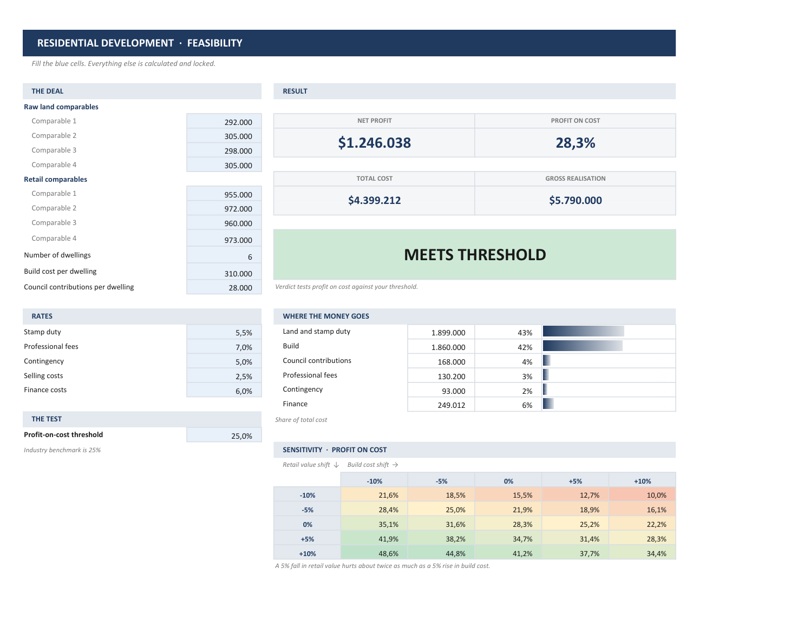
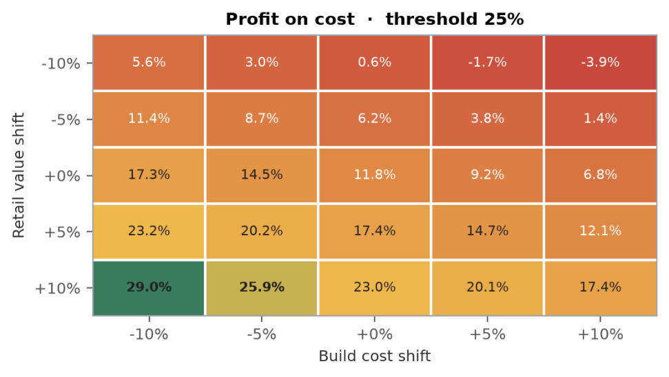
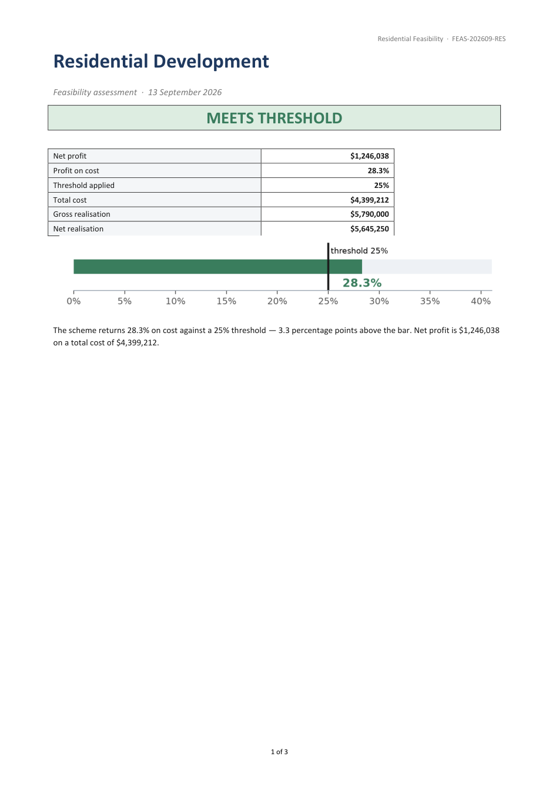
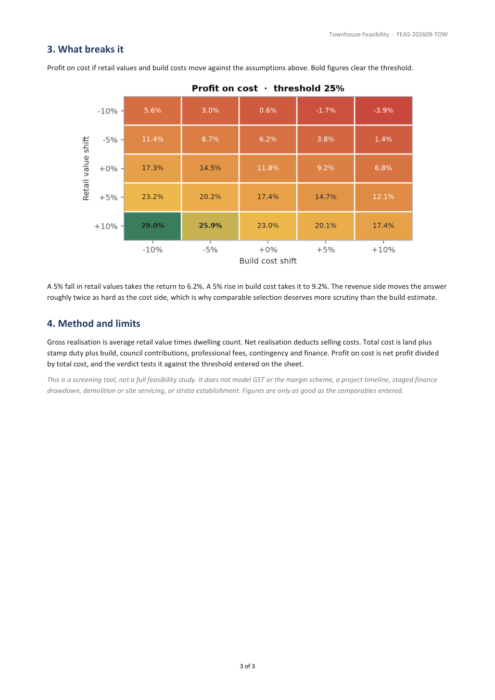

<div align="center">

# Property Feasibility Workbook

**A locked, auto-calculating Excel model that answers one question — does this development clear its profit threshold — and a report generator that turns the answer into a client-ready PDF.**

[](https://www.python.org/)
[](https://openpyxl.readthedocs.io/)
[](LICENSE)

[**📊 Open the workbook**](https://github.com/Strooms/property-feasibility-workbook/raw/main/output/property_feasibility.xlsx) · [**📄 Open a generated report**](https://github.com/Strooms/property-feasibility-workbook/raw/main/output/feasibility_report_residential.pdf) · [**⚙️ The model**](build_workbook.py)



<sub>One sheet per deal type. Blue cells are yours; everything else is calculated, locked and formula-hidden.</sub>

</div>

---

## The problem

A developer screening sites needs a yes or no before spending money on a proper
feasibility study. The usual tool is a spreadsheet someone built once, which
nobody dares touch because a stray keystroke silently breaks a formula three
sections down.

This is that tool, rebuilt so it cannot be broken by the person using it — and
paired with a report generator, because a workbook is a working document while a
PDF is what gets sent to a partner or a lender.

```
output/property_feasibility.xlsx      Start Here · Residential · Townhouse
        │
        ▼
  you fill the blue cells
        │
        ▼
  build_report.py  ──  reads the live calculated values out of Excel,
                       draws the charts, assembles the document
        │
        ▼
output/feasibility_report_residential.docx  +  .pdf
```

## The workbook

| | |
|---|---|
| **Dashboard, not a form** | Four KPI tiles, a verdict banner, a cost breakdown with in-cell bars, and a 5×5 sensitivity grid — all on one landscape page |
| **Inputs only** | 17 unlocked cells. Every other cell is locked **and** formula-hidden, with no password prompt in the way |
| **Editable threshold** | The 25% test is itself an input. Change it and the verdict follows |
| **Two deal types** | Residential and Townhouse on separate tabs — the cost structures genuinely differ |
| **Guards the user** | Percentages constrained to 0–100%, dwelling count to whole numbers above zero, and a zero-cost deal reads `ENTER YOUR DEAL` rather than `#DIV/0!` |
| **Prints clean** | One page per sheet, fitted, with print areas set |

### The sensitivity grid

<div align="center"></div>

Profit on cost as retail values and build costs move ±10%. This is the part that
changes decisions: a 5% fall in retail value hurts about twice as much as a 5%
rise in build cost, so comparable selection deserves more scrutiny than the build
estimate. The same grid is recomputed live in the workbook and redrawn in the
report.

## The report

<div align="center">


</div>

Three pages: verdict and headline numbers with a bullet chart against the
threshold; the deal as entered with its comparables; where the money goes; what
breaks it; and a method-and-limits section that states plainly what the model
does *not* cover.

## Running it

```bash
python -m venv .venv
.venv\Scripts\pip install -r requirements.txt

python build_workbook.py                        # build the workbook
python build_report.py --sheet Residential --pdf   # report from the live values
python verify.py                                # prove the maths
python check_protection.py                      # prove the locking
```

Report options:

```
--sheet {Residential,Townhouse}   which tab to report on
--client NAME                     client name on the report
--pdf                             also export PDF (needs Microsoft Word)
```

## Generating the report from inside Excel

Two routes, covered in [`excel_addin/README.md`](excel_addin/README.md):

- **`Generate report.cmd`** — double-click, pick a deal type, the PDF opens.
  Nothing to install or trust.
- **A ribbon button** — import [`excel_addin/FeasibilityReport.bas`](excel_addin/FeasibilityReport.bas)
  and save it as an `.xlam` add-in. It saves the workbook, runs the generator
  against the live values, and opens the result.

The button is deliberately **not** embedded in the workbook. That would make it
a macro-enabled `.xlsm`, and downloaded `.xlsm` files have their macros blocked
by default, while Google Sheets cannot run VBA at all. The workbook stays a
plain `.xlsx` anyone can open anywhere; the generator sits beside it.

## How it is tested

Two scripts, because "it opens without an error" is not evidence.

**`verify.py`** drives Excel, feeds it deals, and compares every figure against
a *separate* Python implementation of the same arithmetic. Testing the formulas
against themselves would prove nothing.

```
healthy deal              profit on cost  28.32%   MEETS THRESHOLD
losing deal               profit on cost -37.72%   BELOW THRESHOLD
a hair above threshold    profit on cost  25.01%   MEETS THRESHOLD
a hair below threshold    profit on cost  24.99%   BELOW THRESHOLD
units = 0                 profit on cost   0.00%   "ENTER YOUR DEAL"

ALL CHECKS PASSED
```

The two threshold cases are solved algebraically for the retail value that lands
exactly on 25%, then nudged $50 either side — correctness at the edge, not just
absence of errors.

**`check_protection.py`** checks the three locking requirements separately,
because they are three different things, then proves them live: Excel accepts a
value into an input cell and refuses one into a formula cell.

```
17 input cells unlocked, 9 formula cells locked + hidden, sheet protection on
input cell accepted a value under protection
formula cell correctly refused an overwrite
profit-on-cost FormulaHidden = True
```

The builder also writes `output/cellmap.json`, and both test scripts read cell
addresses from it rather than hard-coding them — the layout moves during design
work, and the tests should not care.

## Layout

```
build_workbook.py         the model and its dashboard
build_report.py           Excel -> charts -> DOCX/PDF report
verify.py                 arithmetic, against an independent implementation
check_protection.py       locking, hiding, and input editability
FEASIBILITY-REFERENCE.md  the domain: variables, benchmarks, what makes a deal feasible
output/                   workbook, reports, cell map
docs/                     README previews
```

## A note on Google Sheets

The workbook was uploaded to Google Sheets and tested feature by feature. The
calculations, layout, conditional formatting and data validation all survive.
**The locking does not.**

In Sheets, a formula cell that is locked and formula-hidden in Excel can be
overwritten by typing into it, with no warning. In the test, `999` into one
calculation cell took profit on cost from 28.3% to 136.5% — and the verdict
banner still read MEETS THRESHOLD, in green.

Excel's hidden-formula attribute has no equivalent in Sheets at all, so this is
not a bug to work around: any model that must be both locked down *and*
Sheets-native has to choose which of the two it means.

Full results, method and the three ways to resolve it:
[`GOOGLE-SHEETS-TEST.md`](GOOGLE-SHEETS-TEST.md).

## About the numbers

Every figure in this repository is invented. The comparables, costs and rates
are plausible placeholders for demonstrating the model, not market data, and
nothing here came from a client. `FEASIBILITY-REFERENCE.md` cites published
benchmarks where it quotes them.

This is a screening tool. It does not model GST or the margin scheme, a project
timeline, staged finance drawdown, demolition and site servicing, or strata
establishment.

---

<div align="center">
<sub>Python 3.12 · openpyxl · python-docx · matplotlib · pywin32 · MIT licensed</sub>
</div>
